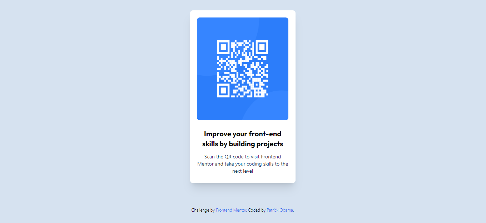

# Frontend Mentor - QR code component solution

This is a solution to the [QR code component challenge on Frontend Mentor](https://www.frontendmentor.io/challenges/qr-code-component-iux_sIO_H). Frontend Mentor challenges help you improve your coding skills by building realistic projects. 

- [Overview](#overview)
  - [Screenshot](#screenshot)
- [My Process](#my-process)
 - [Built With](#built-with)
 - [Useful Resources](#useful-resources)
- [Author](#author)
- [Acknowledgments](#acknowledgments)

## Overview

### Screenshot

## My process

### Built with
- HTML5
- [Tailwind CSS](https://tailwindcss.com/)

### Useful Resourses
- [Tailwind Documentation](https://tailwindcss.com/docs/installation)
- [HTML5 Documentation](https://developer.mozilla.org/en-US/docs/Web/HTML)

## Author
- Patrick Obama

## Acknowledgments
- To be added